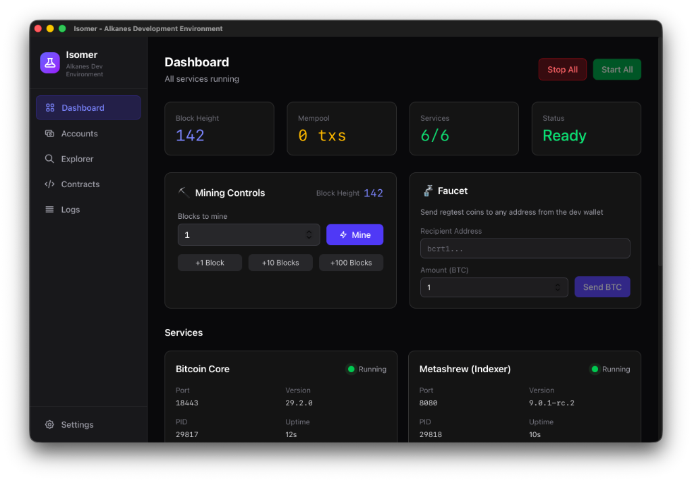

<br />
<div align="center">
  
  <h1>Isomer</h1>
  <p><strong>One-click Alkanes development environment</strong></p>
  <br />
  
  [](LICENSE)
  [](https://tauri.app)
  [](https://www.rust-lang.org)
</div>

<br />

<div align="center">
  
</div>

<br />

**Isomer** is a desktop application that simplifies managing a local Bitcoin Regtest environment with full [Alkanes](https://github.com/kungfuflex/alkanes) metaprotocol support. Built with [Tauri](https://tauri.app/), [React](https://react.dev/), and [Rust](https://www.rust-lang.org/).

---

## ✨ Features

| Feature                   | Description                                                                |
| ------------------------- | -------------------------------------------------------------------------- |
| 🚀 **One-Click Launch**   | Start your entire Alkanes development stack with a single click            |
| 🔧 **Service Management** | Easily control Bitcoin Core, Metashrew, Esplora, Ord, and Alkanes JSON-RPC |
| 🔍 **Espo Explorer**      | Built-in block explorer with Alkanes trace visualization                   |
| 💰 **Faucet & Mining**    | Fund addresses and mine blocks directly from the UI                        |
| 📦 **Binary Management**  | Automatically downloads and verifies required binaries for your platform   |
| 📋 **Integrated Logs**    | Real-time log streaming for all managed services                           |

---

## 🖥️ Managed Services

Isomer orchestrates the following services with proper dependency ordering:

```
┌─────────────────────────────────────────────────────────────┐
│                      Isomer Dashboard                       │
├─────────────────────────────────────────────────────────────┤
│  ┌─────────────┐  ┌─────────────┐  ┌─────────────────────┐  │
│  │ Bitcoin     │  │ Metashrew   │  │ Alkanes JSON-RPC    │  │
│  │ Core        │──│ (Indexer)   │──│ (API Gateway)       │  │
│  │ (Regtest)   │  │             │  │                     │  │
│  └─────────────┘  └─────────────┘  └─────────────────────┘  │
│                                                             │
│  ┌─────────────┐  ┌─────────────┐  ┌─────────────────────┐  │
│  │ Esplora     │  │ Ord         │  │ Espo Explorer       │  │
│  │ (Electrum)  │  │ (Ordinals)  │  │ (Block Explorer)    │  │
│  └─────────────┘  └─────────────┘  └─────────────────────┘  │
└─────────────────────────────────────────────────────────────┘
```

---

## 🚀 Quick Install (Linux/WSL)

```bash
curl -sSf https://raw.githubusercontent.com/jonatns/isomer/main/install.sh | bash
```

This will install all dependencies and set up Isomer automatically.

---

## 🚀 Getting Started

### Prerequisites

- **Rust** — Latest stable toolchain: [rustup.rs](https://rustup.rs/)
- **Node.js** — LTS version recommended
- **pnpm** — Package manager: `npm i -g pnpm`

### Installation

```bash
# Clone the repository
git clone https://github.com/jonatns/isomer.git
cd isomer

# Install dependencies
pnpm install

# Build the application
pnpm tauri build
```

The built application will be available in `src-tauri/target/release/bundle/`.

### Development

For contributors who want to work on Isomer:

```bash
pnpm tauri dev
```

---

## 📁 Project Structure

```
isomer/
├── src/                    # React frontend
│   ├── components/         # UI components
│   └── index.css           # Global styles
├── src-tauri/              # Rust backend (Tauri)
│   ├── src/
│   │   ├── binary_manager.rs   # Binary download & verification
│   │   ├── process_manager.rs  # Service lifecycle management
│   │   └── commands.rs         # Tauri command handlers
│   └── icons/                  # Application icons
└── assets/                 # Documentation assets
```

---

## 🔌 Default Ports

| Service          | Port    |
| ---------------- | ------- |
| Bitcoin RPC      | `18443` |
| Metashrew RPC    | `8080`  |
| Alkanes JSON-RPC | `18888` |
| Esplora Electrum | `50001` |
| Esplora HTTP     | `3002`  |
| Espo Explorer    | `8081`  |
| Ord              | `3001`  |

---

## 📜 License

[MIT](LICENSE)

---

<div align="center">
  <sub>Built with ⚗️ for the Alkanes ecosystem</sub>
</div>
